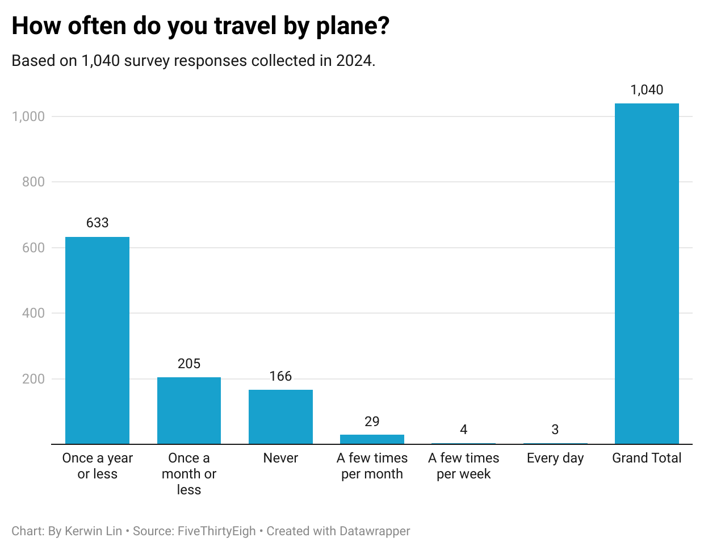

# This is a assignment of Journ 124

## How often do you travel by plane?

This is a chart i made from previous question in data wrapper.

I chose the question 'How often do you travel by plane?' Because it reveals whether people travel by plane or not, and we can know how common airplanes are. I found an interesting phenomenon among 1040 survey respondents, where three people travel by plane every day. This makes me curious about how they manage to travel by plane every day. The remaining information in the chart is normal, with the vast majority of people having one or no experience of traveling by plane in a year, 205 people traveling by plane once a month or less, and so on. Overall, frequent flyers make up a small portion of the total, while infrequent or non flyers dominate.
